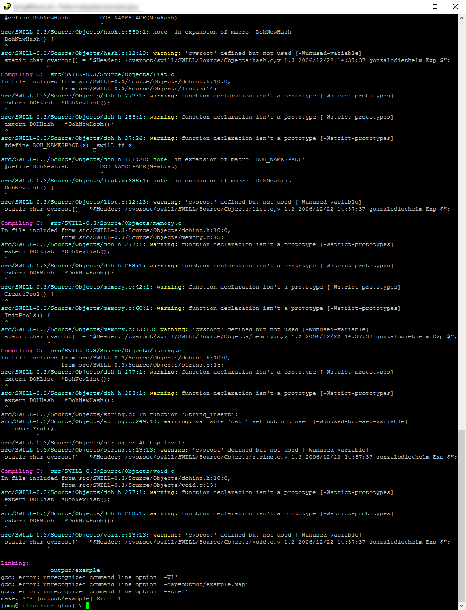

# Header 1
## Header 1
### Header 1
#### Header 1

Ett första testprojekt

git status
- [x] Kalle
- [ ] Nisse
- [ ] Blaha

Visit http://www.di.se

---
Lite testtext:
> ASDFas dsfa adsd f

*Asterisk*

~~~Genomstruket~~~
```C++
int main(int argc, char *argv[]) {
  int error;

  // --- Command line arguments ---
  //---------------------------------------------------------------------------
  struct arg_lit *help     = arg_lit0("h",  "help",                  "Show help");
  struct arg_lit *version  = arg_lit0(NULL, "version",               "Version");
  struct arg_lit *verbose  = arg_lit0("v",  "verbose",               "Verbose output");
  struct arg_end *end      = arg_end(20);

  void *argtable[] = { help, version, verbose, end};

  if (arg_nullcheck(argtable) != 0) {
    /* NULL entries were detected, some allocations must have failed */
    printf("Argtable: insufficient memory\n");
    exit(0);
  }

  error = arg_parse(argc,argv,argtable);

  if (error > 0) {
    arg_print_errors(stdout,end,"program");
    exit(1);
  }
  if (verbose->count) {
  }

  if (version->count) {
    printf("Program version %s\nBuild ("__DATE__" "__TIME__")\n", VERSION);
    exit(0);
  }

  // Print helptext
  if (help->count) {
    arg_print_glossary(stdout,argtable,"  %-30s %s\n");
    exit(0);
  }

  printf("Ett litet testprogram.\n");

  lua_State *L = luaL_newstate();
  luaL_openlibs(L);
  luaL_dofile(L, "test.lua");
  //luaL_close(L);


  return 0;
}
```

